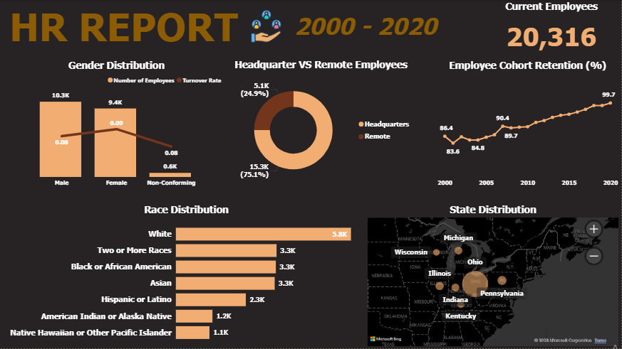
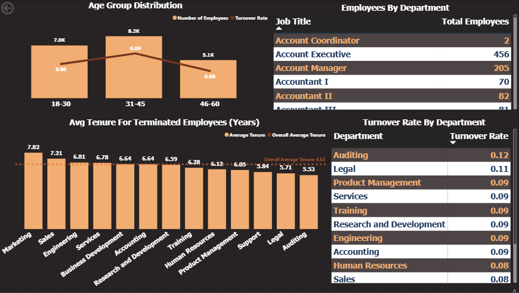

# HR-Dashboard-MySQL-PowerBI

## Description

Human Resources dashboard using Power BI.

This dashboard provid a view of HR performance, key workforce insights and support data-driven decision making.

## Data & Tools Used

**Data** - HR Data containing over 22000 records from the year 2000 to 2020.

**Data Cleaning & Analysis** - SQL server

**Data Visualization** - PowerBI

## Questions

1. What is the gender breakdown of employees in the company?
2. What is the race/ethnicity breakdown of employees in the company?
3. What is the age distribution of employees in the company?
4. How many employees work at headquarters versus remote locations?
5. What is the average length of employment for employees who have been terminated?
6. How does the gender distribution vary across departments and job titles?
7. What is the distribution of job titles across the company?
8. Which department has the highest turnover rate?
9. What is the distribution of employees across locations by state?
10. How has the company's employee count changed over time based on hire and term dates?
11. What is the tenure distribution for each department?

## Key Insights

 - Number of employees is 18285.
 - There are more male employees.
 - White race is the most dominant while Native Hawaiian and American Indian are the least.
 - The youngest employee is 24 years old and the oldest is 61 years old.
 - 3 age groups were created (18-34, 35-49, 50-65). A large number of employees were between 35-49 followed by 50-65 while the smallest group was 18-34.
 - A large number of employees work at the headquarters versus remotely(75% of total employees).
 - A large number of employees come from the state of Ohio.
 - The average length of employment for terminated employees is around 8.3 years.
 - The Auditing department has the highest turnover rate (0.19) and the least is Marketing (0.10).
 - The net change in employees has increased over the years.
 - The average tenure for each department is about 8 years with Sales have the highest and Legal, Product Management and Training having the lowest.

## Limitations

- Some termdates were far into the future and were not included in the analysis(1116 records). The only term dates used were those less than or equal to the current date (Feb 2026).
