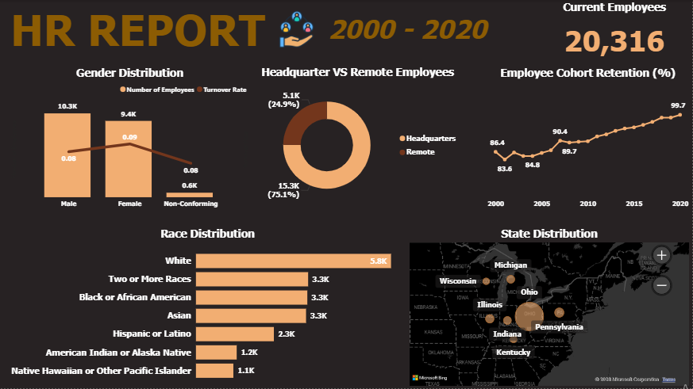
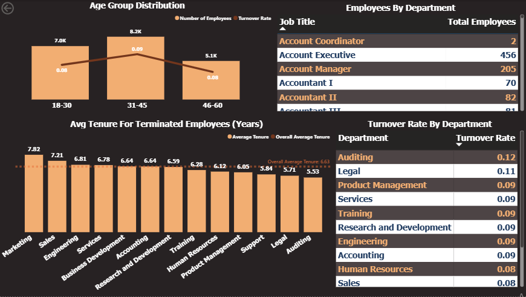

# HR-Dashboard-MySQL-PowerBI

## Description

Human Resources dashboard using Power BI.

This dashboard provides insights into HR performance, key workforce insights, and support data-driven decision making.

## Data & Tools Used

**Data** - HR Data containing over 22000 records from the year 2000 to 2020.

**Data Source** - ([Human Resources.csv](Human%20Resources.csv))

**Data Cleaning & Analysis** - SQL server [(Cleaning_Queries.sql)](Cleaning_Queries.sql) / [(Questions_Queries.sql)](Questions_Queries.sql)

**Data Visualization** - PowerBI [(HR_Report.pbix)](HR_Report.pbix)

## Objective

Analyze workforce demographics, retention, and turnover trends to support strategic workforce planning and organizational growth. 

## Key Insights

 - Number of current employees is 20316.
 - There are more male employees.
 - The white race is the most dominant while Native Hawaiian and American Indian are the least.
 - The youngest employee is 18 years old and the oldest is 55 years old.
 - 3 age groups were created (18-30, 31-45, 46-60). A large number of employees were between 31-45 followed by 18-30 while the smallest group was 46-60.
 - A large number of employees work at the headquarters versus remotely(75% of total employees).
 - The average length of employment for terminated employees is around 6.6 years.
 - A large number of employees come from the state of Ohio.
 - The Marketing department has the highest average tenure (7.82 years) and the Auditing department has the lowest (5.53 years).
 - The Auditing has the highest turnover rate (0.12) and the least is Business Development (0.08).
 - Employee cohort retention has shown consistent improvement over time.

  ## Recommendations

  - Create plans to reduce turnover in departments with high exits especially in the Auditing department and among female employees compared to males, by understanding why they leave and improving their experience.
  - Give additional attention to younger employees (18-30) as an important group for future growth, and attract more of them with internships and entry-level jobs.
  - Work on increasing the average tenure in the departments below the overall company average such as Auditing, Legal and Support by using targeted training programmes, clear growth paths and ongoing feedback to lengthen employee tenure.

## Note

- The analysis covers the period from 2000 to 2020. Employees who left after 2020 were included in the analysis as if they were still active during the 2000 to 2020 period.  
